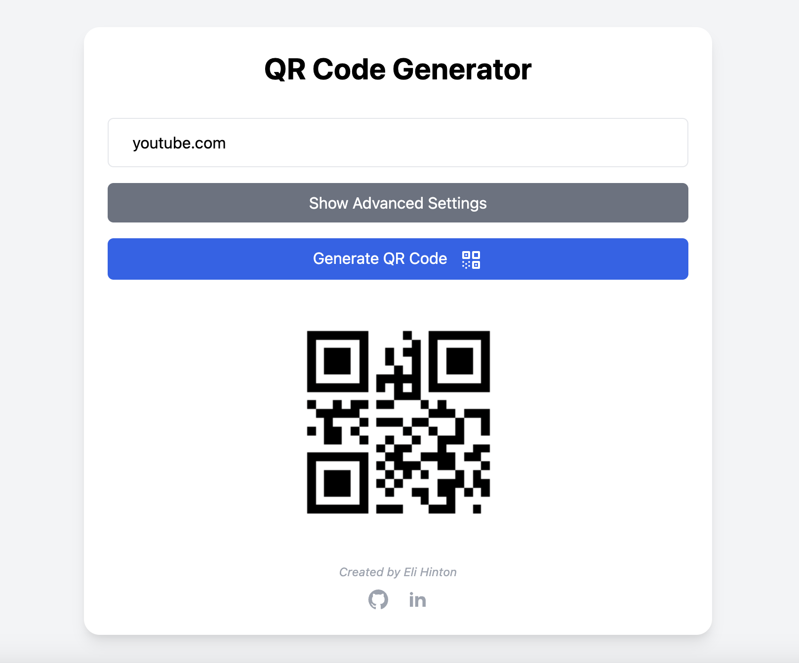

# QR Code Generator

A simple, flexible QR code generator available in both **Python** and **JavaScript (web)** versions. Easily create QR codes for any URL with optional customization for size, border, and colors.



---

## Python Script Version

### Overview
This Python script generates QR codes from any URL and allows for optional customization of:

- QR code **size** (number of pixels per box)
- **Border width**
- **Content color** (QR code color)
- **Background color**
- Output **filename**

It also automatically previews the generated QR code using your system's default image viewer.

### Features
- Quick generation from the command line
- Optional customization for design
- Automatic PNG output
- Cross-platform image preview

### Installation
Make sure Python is installed, then install dependencies:

```bash
pip install qrcode[pil]
```

### Usage
There are various customisations available for QR code generation engrained in this script. The allowed formats can be seen below.
```bash
python qr_code.py <link> <outputfilename.png>
python qr_code.py <link> <size> <border> <outputfilename.png>
python qr_code.py <link> <size> <border> <content-color>  <bg-color> <outputfilename.png>
python qr_code.py <link> <content-color> <bg-color> <outputfilename.png> 
```
For example, the following is valid:
```bash
python qr_code.py https://youtube.com 10 4 red black yt_qrcode.png
```

## Javascript Version (Web Browser)

A single-page web application version of the QR code generator. This allows users to:
- Input a URL
- Generate a QR code directly in the browser
- Customize optional parameters like size, border, content color, and background color
- Download the generated QR code as a PNG image
The web version leverages modern JavaScript and TailwindCSS for a simple, responsive user interface.

### Features
- Browser-based, no installation required
- Real-time preview of QR code
- Advanced customization options
- Single-page application for simplicity

### How It Works
1. Enter the URL into the input box.
2. (Optional) Click "Advanced Settings" to adjust size, border, colors, and filename.
3. Click "Generate QR Code".
4. The QR code is displayed and automatically downloaded as a PNG.

### Usage/Demo
Visit `https://elihinton.github.io/qr-code-generator/` to give it a try

## Use Cases
- Quickly generate QR codes for websites, social media links, or documents
- Customize QR codes for presentations, marketing, or personal projects
- Integrate into other applications or websites
